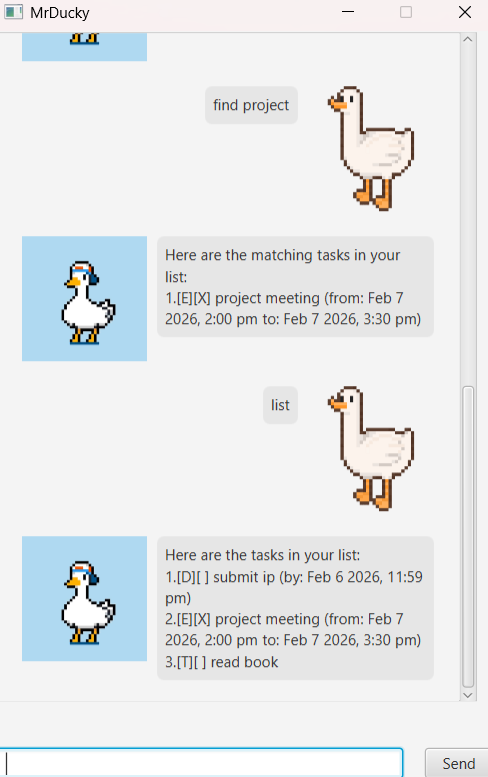

# MrDucky User Guide



MrDucky is a simple task tracker with a friendly GUI. You can add tasks, mark them done, find tasks by keyword, and delete tasks when they are no longer needed.

## Quick Start
1. Launch the app.
2. Type a command in the input box.
3. Press Enter or click Send.

## Command Format
Commands follow this pattern:
`command <arguments>`

Date and time input uses `d/MM/yyyy HHmm` (24-hour). Example: `23/02/2026 1800`.

## Task Types and Display Format
MrDucky shows tasks with a type and done marker:

```
[T][ ] read book
[D][X] return book (by: Feb 23 2026, 6:00 PM)
[E][ ] project meeting (from: Feb 24 2026, 2:00 PM to: Feb 24 2026, 3:30 PM)
```

## Commands

### Add a todo
Adds a simple task.

Usage:
`todo <description>`

Example:
`todo read book`

Expected response (example):
```
Got it. I've added this task:
  [T][ ] read book
Now you have 1 tasks in the list.
```

### Add a deadline
Adds a task with a due date/time.

Usage:
`deadline <description> /by d/MM/yyyy HHmm`

Example:
`deadline return book /by 23/02/2026 1800`

Expected response (example):
```
Got it. I've added this task:
  [D][ ] return book (by: Feb 23 2026, 6:00 PM)
Now you have 2 tasks in the list.
```

### Add an event
Adds a task with a start and end time.

Usage:
`event <description> /from d/MM/yyyy HHmm /to d/MM/yyyy HHmm`

Example:
`event project meeting /from 24/02/2026 1400 /to 24/02/2026 1530`

Expected response (example):
```
Got it. I've added this task:
  [E][ ] project meeting (from: Feb 24 2026, 2:00 PM to: Feb 24 2026, 3:30 PM)
Now you have 3 tasks in the list.
```

### List tasks
Shows all tasks with their indexes.

Usage:
`list`

Expected response (example):
```
Here are the tasks in your list:
1.[T][ ] read book
2.[D][ ] return book (by: Feb 23 2026, 6:00 PM)
3.[E][ ] project meeting (from: Feb 24 2026, 2:00 PM to: Feb 24 2026, 3:30 PM)
```

### Mark a task as done
Marks a task as completed.

Usage:
`mark <index>`

Example:
`mark 2`

### Unmark a task
Marks a task as not done.

Usage:
`unmark <index>`

Example:
`unmark 2`

### Delete a task
Removes a task from the list.

Usage:
`delete <index>`

Example:
`delete 1`

### Find tasks by keyword
Finds tasks containing a keyword in their description.

Usage:
`find <keyword>`

Example:
`find book`

### Help
Shows the help message.

Usage:
`help`

### Exit
Closes the app.

Usage:
`bye`

## Notes
- Indexes are 1-based, so the first task is `1`.
- Input dates must follow `d/MM/yyyy HHmm` (e.g. `2/12/2019 1800`).

## Common Errors
- If an index is out of range, MrDucky shows an error message.
- If a description is missing, MrDucky asks you to provide one.
- If the date format is invalid, MrDucky asks you to use the correct format.
- If the command is unknown, MrDucky reports it cannot understand the command.

## Data Storage
Tasks are saved to `data/mrducky.txt` in the project folder and are loaded automatically on startup.
